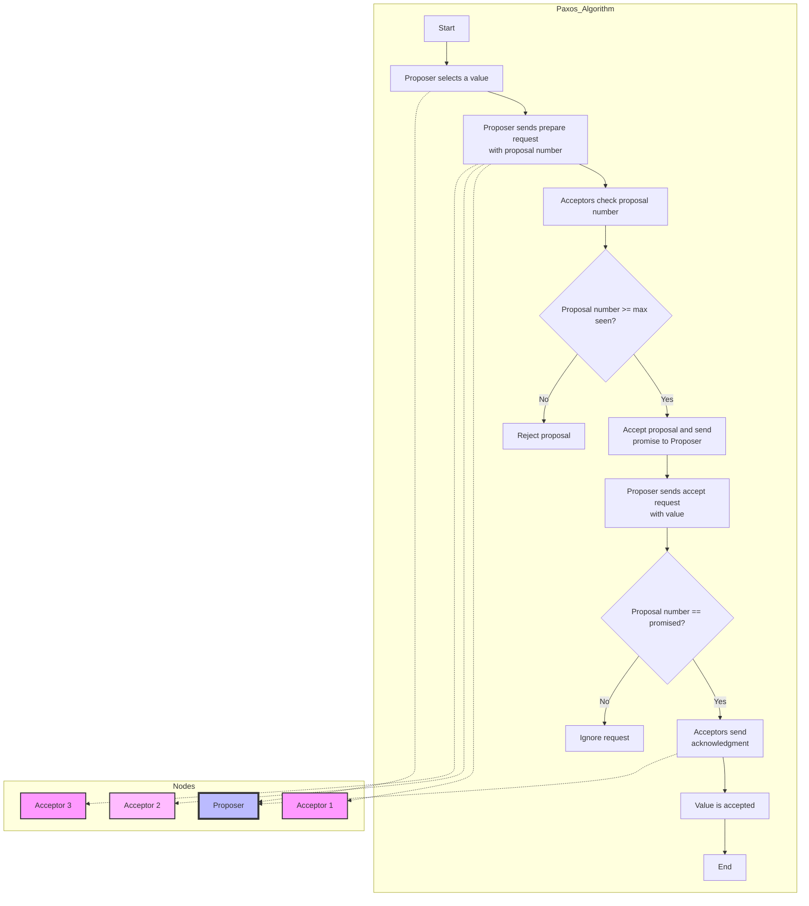
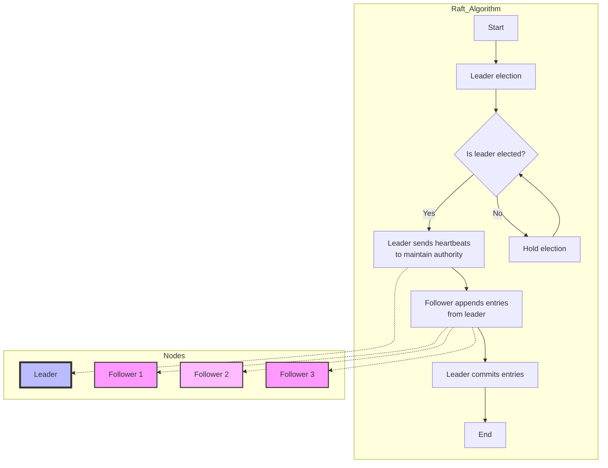
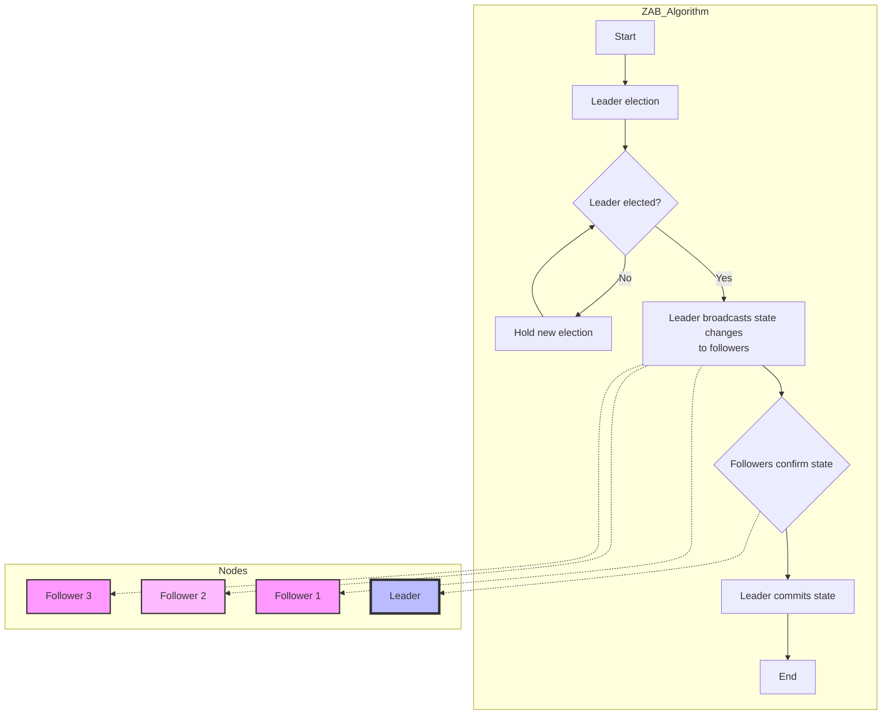
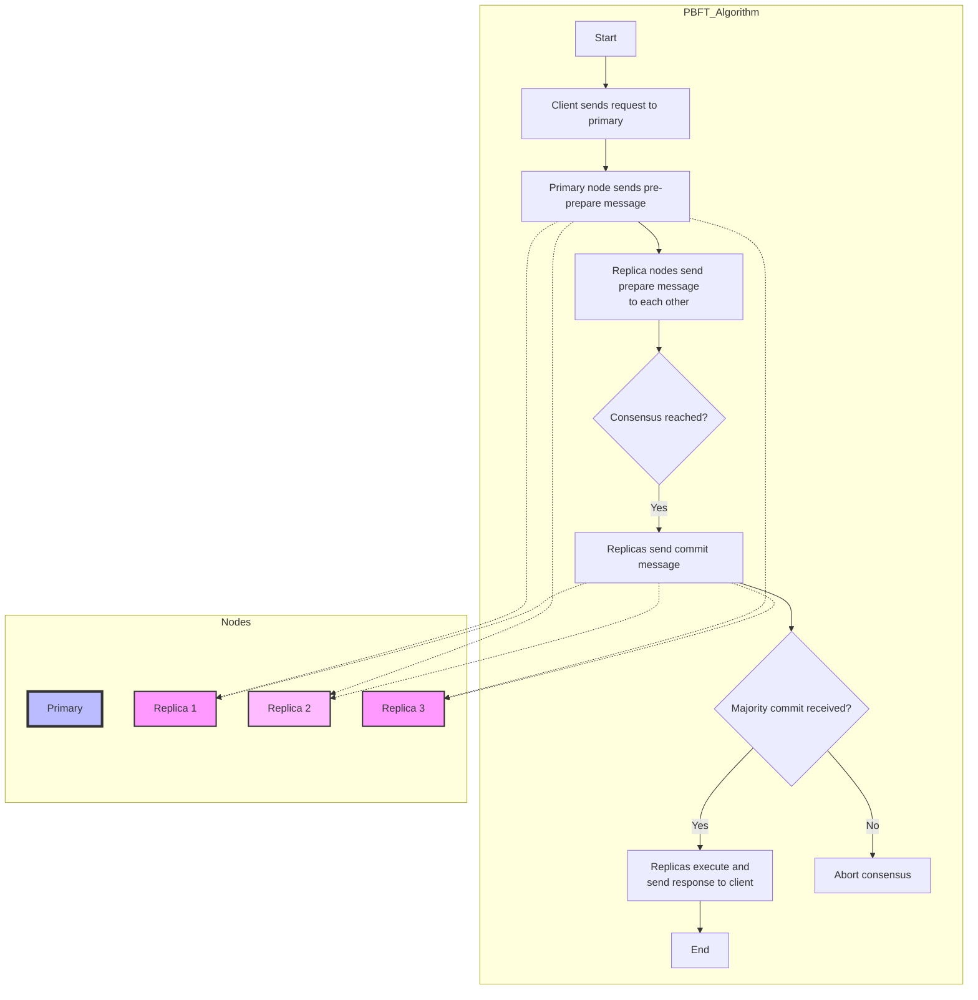
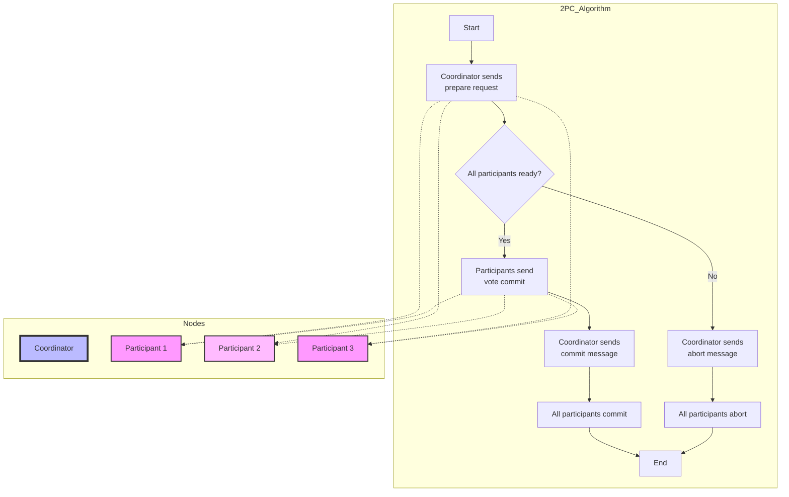
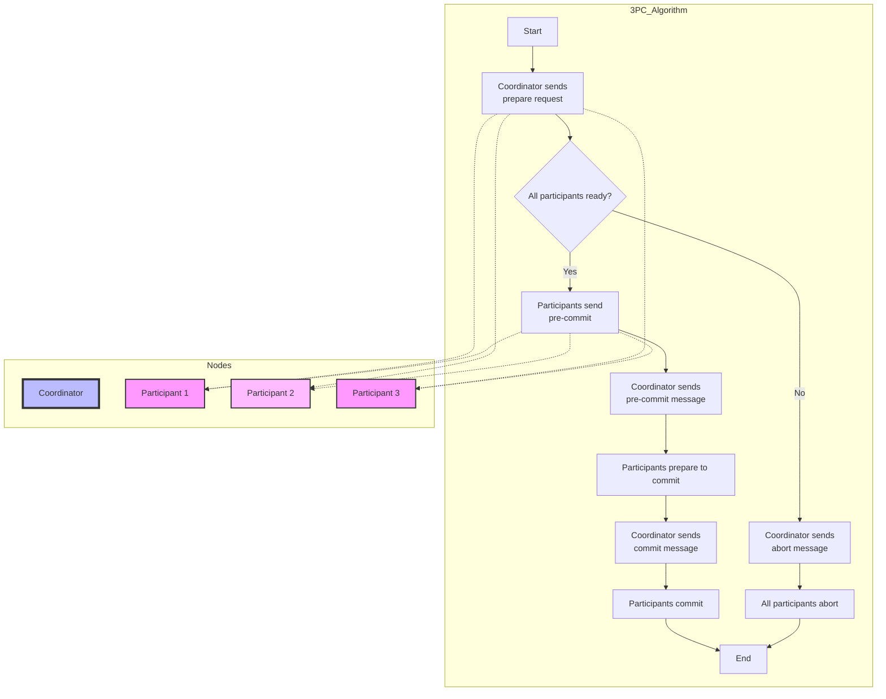

# Visual Guide to Consensus Algorithms

This guide provides visual representations of some of the most widely used consensus algorithms using Mermaid charts. Consensus algorithms are crucial for achieving agreement among distributed nodes in a network, ensuring consistency, availability, and fault tolerance. Each algorithm follows a unique mechanism to reach consensus among multiple nodes or replicas.

## 1. Paxos Consensus Algorithm

Paxos is a fault-tolerant distributed consensus algorithm that coordinates agreement among multiple nodes on a single value.

## 2. Raft Consensus Algorithm

Raft is a leader-based consensus algorithm that is simpler to understand than Paxos. It divides the problem into leader election, log replication, and safety.

## 3. Zookeeper Atomic Broadcast (ZAB)

Zookeeper Atomic Broadcast (ZAB) is a consensus protocol used in Zookeeper to manage leader election and broadcast state changes.

## 4. Byzantine Fault Tolerance (PBFT)

Practical Byzantine Fault Tolerance (PBFT) is a consensus algorithm designed to tolerate Byzantine faults, where nodes can fail or act maliciously.

## 5. Two-Phase Commit (2PC)

Two-phase commit (2PC) is a distributed consensus algorithm used in database systems to ensure atomic transactions.

## 6. Three-Phase Commit (3PC)

Three-phase commit (3PC) enhances 2PC to prevent blocking in case of a coordinator failure.

This guide covers essential consensus algorithms used in distributed systems, highlighting the mechanisms that ensure data consistency and fault tolerance across multiple nodes.
